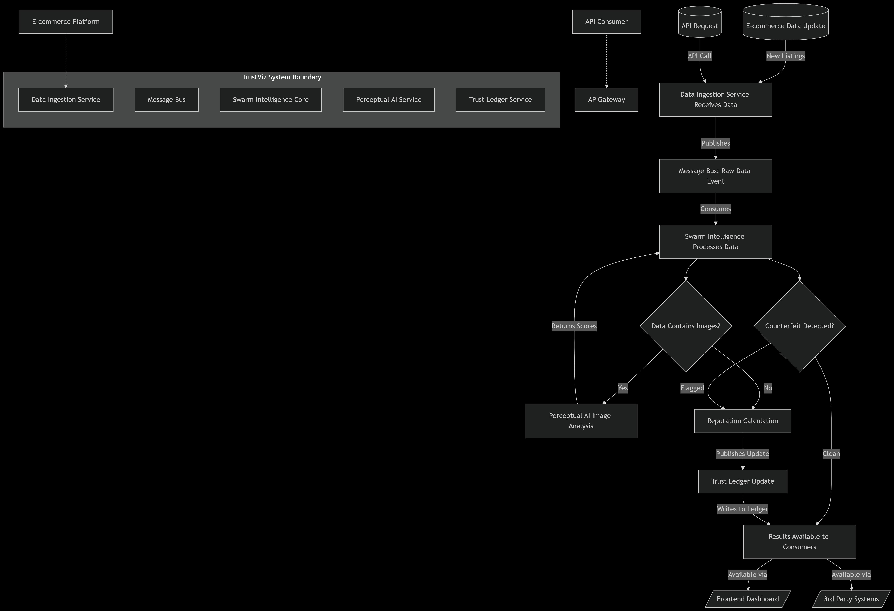

# 🚀 Trust-viz: A Comprehensive Trust Scoring System

## Table of Contents

- [🚀 Trust-viz: A Comprehensive Trust Scoring System](#-trust-viz-a-comprehensive-trust-scoring-system)
- [📈 The Counterfeit Crisis](#-the-counterfeit-crisis)
- [⚠️ Why Current Solutions Fall Short](#-why-current-solutions-fall-short)
- [TrustViz's Multi-Layered Defence](#trustvizs-multi-layered-defence-️)
- [TrustViz vs. Traditional Systems](#trustviz-vs-traditional-systems-️)
- [🔍 Core Modules](#-core-modules)
- [🏗️ Architecture Overview](#️-architecture-overview)
- [🧰⚙️ Technologies Used](#️-technologies-used)
- [🛠️ Installation & Setup](#️-installation--setup)

---

# 🚀 Trust-viz: A Comprehensive Trust Scoring System

**Trust-viz** empowers online marketplaces with a powerful toolkit to detect and mitigate fraudulent activity, enhancing user confidence and transparency. By combining advanced **Image Authenticity Analysis**, **Review Authenticity Analysis**, and **Seller Behavioral Profiling**, Trust-viz generates reliable **Trust Scores** for products and sellers — enabling safer shopping experiences.

---

## 📈 The Counterfeit Crisis

The global counterfeit market hit a staggering **\$2.2 trillion in 2022**, devastating economies and eroding consumer trust worldwide. The pandemic accelerated online counterfeiting, with a **40% surge in fake listings**. Major platforms like Amazon responded by blocking **6 billion fraudulent listings in 2022**, underscoring the urgency for innovative solutions.

---

## ⚠️ Why Current Solutions Fall Short

* **Manual Reviews:** Labor-intensive, slow, and costly — incapable of scaling with listing volume.
* **Basic Image Matching:** Easily fooled by sophisticated counterfeiters altering images.
* **Isolated Metrics:** Fragmented data fails to provide holistic risk insights.

Trust-viz addresses these gaps with automated, multi-layered analytics and data fusion to deliver robust, real-time trust assessments.

## TrustViz's Multi-Layered Defence 🛡️

TrustViz employs a robust, multi-layered defense system to combat counterfeiting effectively:

- **Product Listing** 📝  
  Initial data capture of all product information.

- **Data Ingestion** 📥  
  Comprehensive collection of product data, including images, reviews, and seller profiles.

- **Perceptual AI** 🤖🖼️  
  Advanced image analysis verifies material texture, logo placement, print quality, and packaging authenticity. It also detects AI-generated images, achieving **95% accuracy** in detecting counterfeits.

- **Swarm Intelligence** 🐜🧠  
  Inspired by ant colony optimization, this module uses multiple agents to analyze price patterns, seller behavior, image authenticity, and customer feedback. This self-learning system adapts to new fraud patterns.

- **Blockchain Record / Trust Ledger** 🔗📜  
  Secure, decentralized, and immutable record-keeping of trust scores and related verification data, ensuring transparency and integrity.

---

## TrustViz vs. Traditional Systems ⚔️🏆

| Feature            | Traditional Systems     | TrustViz                  |
| :----------------- | :--------------------- | :------------------------ |
| **Image Analysis**   | Single algorithm        | Multi-algorithm DinoHash  |
| **Trust Storage**    | Centralized database    | Blockchain ledger         |
| **Decision Making**  | Rule-based              | Swarm intelligence        |
| **Processing Time**  | Batch processing        | Real-time                 |
| **Cross-platform**   | ❌                      | ✅                        |
| **Trust History**    | Mutable                 | Immutable                 |

---

## 🔍 Core Modules

| Module                  | Description                                                |
| ----------------------- | ---------------------------------------------------------- |
| **Image Authenticity**  | Deep analysis detecting image manipulations and reuploads  |
| **Review Authenticity** | NLP-driven detection of fake or biased product reviews     |
| **Seller Profiling**    | Behavioral pattern analysis to identify suspicious sellers |

Together, these modules synthesize to create a **Trust Score** reflecting a product’s or seller’s credibility.

---

## 🏗️ Architecture Overview

Here's a high-level overview of the Trust-viz system architecture:



The system is composed of several microservices, each responsible for a specific analytical task:
*   **Data Ingestion**: Responsible for collecting raw data (images, reviews, seller profiles).
*   **Perceptual AI**: Handles image authenticity analysis.
*   **Review Analyzer**: Processes and authenticates product reviews.
*   **Seller Behavior Analyzer**: Profiles seller activities.
*   **Swarm Intelligence**: Likely aggregates and processes data from various modules to derive insights.
*   **Trust Ledger**: A blockchain-based component for maintaining an immutable record of trust scores and related data.

These services communicate to provide a comprehensive trust assessment.

## 🧰⚙️ Technologies Used

*   **Python**: Primary programming language for all services.
*   **Docker / Docker Compose**: For containerization and orchestration of microservices.
*   **Image Processing**: `imagehash`, `OpenCV` for image analysis.
*   **Natural Language Processing**: `CLIP` (for image-text similarity), `BERT` (HuggingFace) for sentiment analysis, `TF-IDF`, `Cosine Similarity` for text uniqueness.
*   **Data Analysis**: Time-series anomaly detection, graph-based linkage.
*   **Blockchain**: For the Trust Ledger component.

## 🛠️ Installation & Setup

```bash
# Clone the repository
git clone https://github.com/yourusername/trust-viz.git

# Navigate into the directory
cd trust-viz

# Install dependencies
pip install -r requirements.txt

# Run initial setup
python setup.py
```

## Accessing Services:
Once the services are running, you can interact with them via their exposed ports (if any) or through internal Docker network communication. Refer to individual service documentation (e.g., services/perceptual-ai/README.md) for specific API endpoints or usage instructions.
